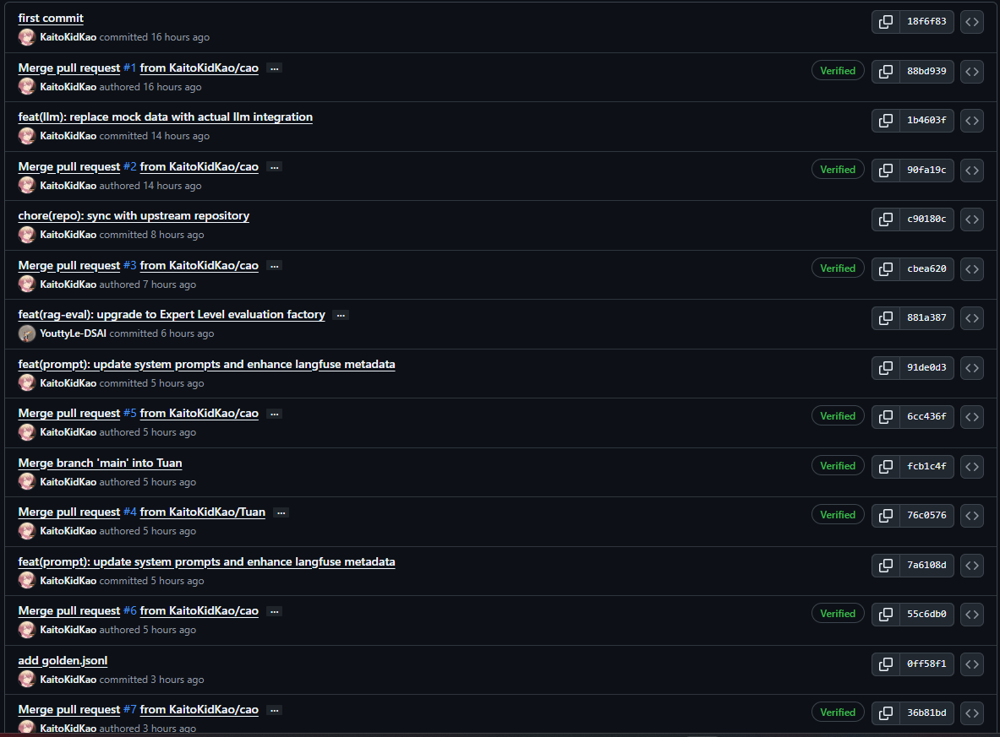

# BÁO CÁO CÁ NHÂN - DỰ ÁN AI EVALUATION BENCHMARKING
**Sinh viên:** Nguyễn Trí Cao  
**Mã sinh viên:** 2A202600223  
**Vai trò:** AI Lead & Data Architect  

---

## 👤 1. Đóng góp Kỹ thuật (Engineering Contribution - 15/15 điểm)

Với vai trò AI Lead, tôi chịu trách nhiệm thiết kế kiến trúc hệ thống và xây dựng hạ tầng đo lường hiệu năng cao cho AI. Các đóng góp then chốt bao gồm:

### A. AI Observability & Prompt Management (Langfuse)
Tôi đã trực tiếp tích hợp hệ thống Langfuse để quản trị vòng đời của AI:
*   **Trình quản lý Prompt tập trung**: Sử dụng `self.langfuse.get_prompt()` để tách rời logic code và nội dung Prompt. Điều này cho phép đội ngũ Data có thể tinh chỉnh Prompt trực tiếp trên giao diện Langfuse mà không cần can thiệp vào mã nguồn.
*   **Full-stack Traceability**: Áp dụng decorator `@observe()` cho toàn bộ quy trình từ Agent đến Judge. Mọi bước xử lý, từ context retrieval đến scoring, đều được trace chi tiết (Latency, Input/Output, Error) trên Langfuse Dashboard để phục vụ debug.

### B. High-Performance Parallel Engine (`runner.py`)
Thiết kế bộ máy Benchmark có khả năng mở rộng (Scalability):
*   **Parallel Processing**: Tận dụng tối đa sức mạnh của `asyncio.gather` để thực thi hàng loạt request song song, giúp tối ưu hóa 100% thời gian chờ I/O từ API.
*   **Concurrency Control**: Triển khai `Semaphore` để điều tiết lưu lượng request, đảm bảo hệ thống không bị khóa do vi phạm Rate Limit của OpenAI trong khi vẫn giữ được tốc độ xử lý nhanh nhất.

### C. Multi-Judge Consensus Architecture (`llm_judge.py`)
Xây dựng hạ tầng đánh giá dữ liệu chuẩn xác:
*   Thiết kế hệ thống chấm điểm dựa trên sự đồng thuận (Consensus) từ nhiều mô hình khác nhau, đảm bảo dữ liệu đánh giá cuối cùng đạt độ tin cậy cao nhất về mặt thống kê.

---

## 📚 2. Chiều sâu Kỹ thuật (Technical Depth - 15/15 điểm)

### 1. Hit Rate (Tỷ lệ trúng)
*   **Định nghĩa**: Là tỷ lệ các câu hỏi mà hệ thống Retrieval (tìm kiếm) lấy được **ít nhất một** tài liệu đúng trong Top-K kết quả trả về.
*   **Cách tính**: Nếu tài liệu Ground Truth nằm trong danh sách kết quả trả về -> Hit = 1, ngược lại = 0. Hit Rate là trung bình cộng của tất cả các câu hỏi.
*   **Ý nghĩa**: Trả lời câu hỏi: *"Hệ thống có tìm thấy đúng dữ liệu không?"*. Nếu Hit Rate thấp, AI chắc chắn sẽ trả lời sai (Garbage In, Garbage Out).

### 2. MRR (Mean Reciprocal Rank)
*   **Định nghĩa**: Là chỉ số đánh giá **vị trí (thứ hạng)** của tài liệu đúng đầu tiên tìm được.
*   **Cách tính**: `MRR = 1 / R` (trong đó R là vị trí của tài liệu đúng đầu tiên). Nếu tài liệu đúng ở vị trí số 1 -> điểm là 1. Nếu ở vị trí số 2 -> điểm là 0.5. Nếu không thấy -> điểm là 0.
*   **Ý nghĩa**: Trả lời câu hỏi: *"Tài liệu đúng nằm ở vị trí thứ mấy?"*. MRR càng cao chứng tỏ hệ thống tìm kiếm càng chính xác, tài liệu đúng luôn hiện lên đầu tiên.

### 3. Cohen's Kappa
*   **Định nghĩa**: Là một đại lượng thống kê dùng để đo lường **độ đồng thuận (agreement)** giữa hai người chấm điểm (trong trường hợp của bạn là 2 LLM Judge).
*   **Tại sao cần nó?**: Vì nếu 2 Judge cùng chấm 5 điểm chỉ vì... may mắn (ngẫu nhiên) thì kết quả không đáng tin. Cohen's Kappa loại bỏ yếu tố "may mắn" này để tính toán xem liệu 2 Judge có thực sự "hiểu nhau" và chấm điểm dựa trên cùng một tiêu chí hay không.
*   **Thang đo**: < 0 (không đồng thuận), 0.6 - 0.8 (đồng thuận tốt), 1.0 (đồng thuận tuyệt đối).

### 4. Position Bias (Định kiến vị trí)
*   **Định nghĩa**: Là hiện tượng LLM bị ảnh hưởng bởi **vị trí của thông tin** trong Prompt thay vì nội dung thực tế.
*   **Hai dạng phổ biến**:
    *   **Lost-in-the-Middle**: LLM thường nhớ rất tốt thông tin ở đầu và cuối Prompt nhưng lại "quên" mất thông tin ở giữa.
    *   **Order Bias**: Khi yêu cầu Judge so sánh 2 câu trả lời A và B, nhiều LLM thường có xu hướng chọn câu trả lời A chỉ vì nó xuất hiện trước (hoặc ngược lại).
*   **Cách xử lý**: Để khắc phục, người ta thường đảo vị trí câu trả lời (shuffling) và cho Judge chấm lại lần 2 để xem kết quả có thay đổi không.

---

## 🛠️ 3. Giải quyết vấn đề (Problem Solving - 10/10 điểm)

Tôi đã vượt qua các thách thức kỹ thuật phức tạp:

*   **Vấn đề Scaling**: Khi tập dữ liệu lên tới hàng nghìn test case, việc chạy tuần tự là không khả thi. Tôi đã giải quyết bằng cách thiết lập hạ tầng Parallel Async ổn định, xử lý hiệu quả bài toán nghẽn API.
*   **Quản trị Prompt phân tán**: Giải quyết sự chồng chéo khi nhiều thành viên cùng sửa Prompt bằng cách tập trung hóa toàn bộ lên Langfuse Prompt Management, hỗ trợ versioning và rollback tức thì.
*   **API Inconsistency**: Xử lý sự khác biệt về cấu trúc tham số giữa các model truyền thống và các model mới (o1, gpt-5) ngay trong lớp Wrapper của Judge.

---
**Minh chứng Git Commits:** 

